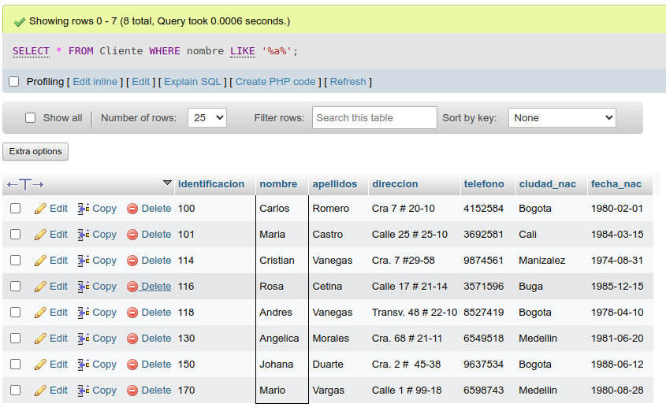
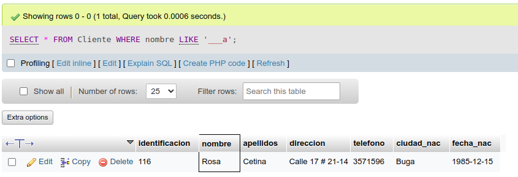
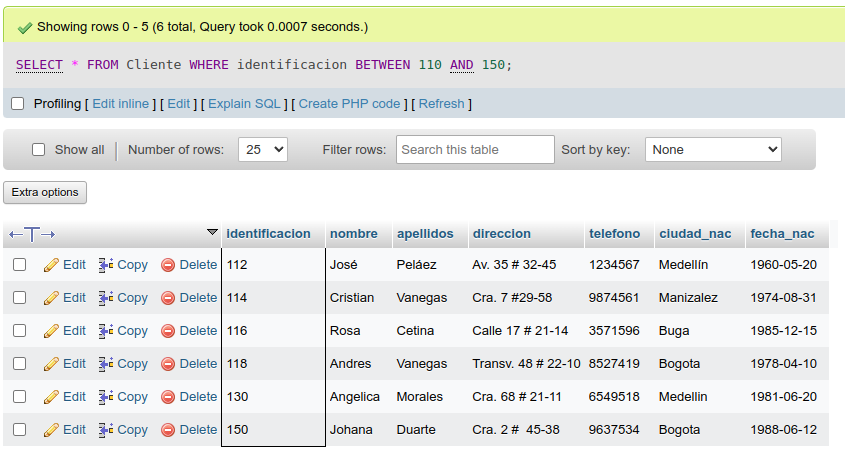
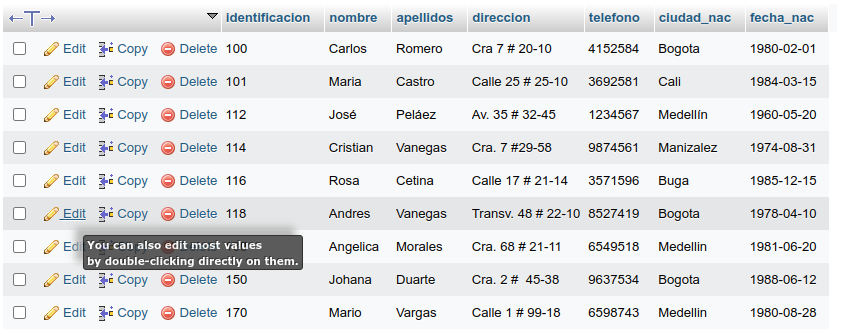
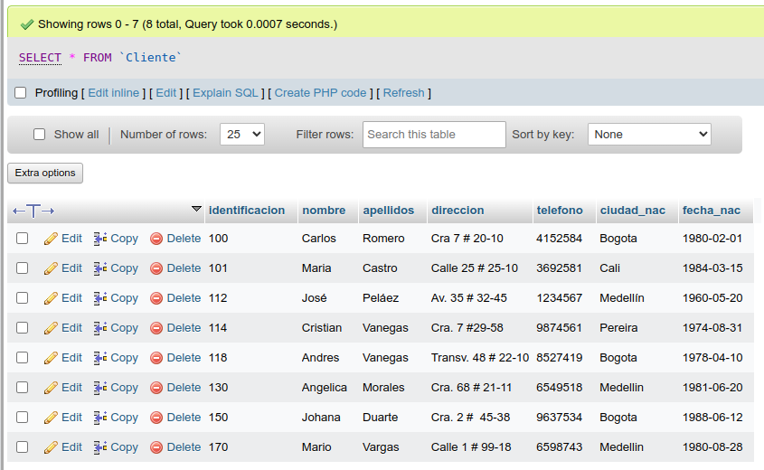
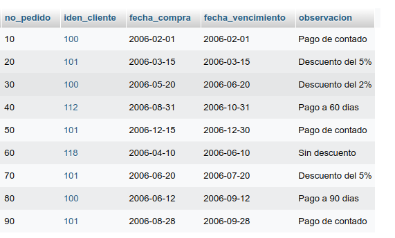
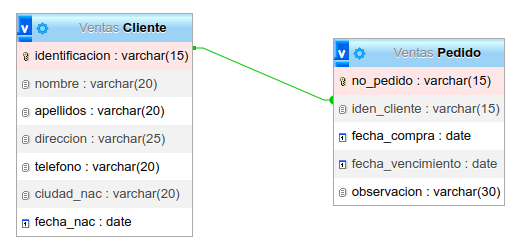
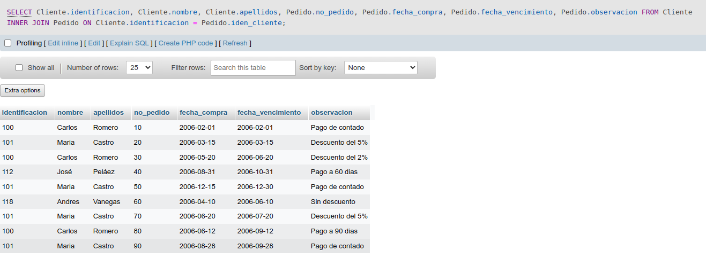

# consultas_1_sql
# Introducción a las consultas a una BD usando el lenguaje SQL

## Base de datos: Ventas
## Tabla: Cliente

## Instruccion SELECT
- Permite seleccionar datos de una tabla.
- Su formato es: `SELECT campos_tabla FROM nombre_tabla`

### Consulta No. 1
1. Para visualizar toda la información que contiene la tabla Cliente se puede incluir con la instrucción SELECT el carácter **\*** o cada uno de los campos de la tabla.

- `SELECT * FROM Cliente`

- `SELECT identificacion, nombre, apellidos, direccion, telefono, ciudad_nac, fecha_nac FROM Cliente`

### Consulta No. 2

2. Para visualizar solamente la identificacion del Cliente: `SELECT identificacion FROM Cliente`

### Consulta No. 3

3. Si se desea obtener los registros cuya identificacion sea mayor o igual a 150, se debe utilizar la cláusula `WHERE` que especifica las condiciones que deben reunir los registros que se van a seleccionar: `SELECT * FROM Cliente WHERE identificacion>=150`

### Consulta No. 4

4. Se desea obtener los registros cuyos apellidos sean Vanegas o Cetina, se debe utilizar el operador `IN` que especifica los registros que se quieren visualizar de una tabla.

`SELECT apellidos, nombre FROM Cliente WHERE apellidos IN('Vanegas', 'Cetina')`

O se puede utilizar el operador `OR`

`SELECT apellidos, nombre FROM Cliente WHERE apellidos = 'Vanegas' OR apellidos = 'Cetina'`

### Consulta No. 5

5. Se desea obtener los registros cuya identificación sea menor de 110 y la ciudad sea Cali, se debe utilzar el operador `AND`

`SELECT * FROM Cliente WHERE identificacion<=110 AND ciudad_nac = 'Cali'`

### Consulta No. 6

6. Si se desea obtener los registros cuyos nombres empiecen por la letra 'A', se debe utilizar el operador `LIKE` que utiliza los patrones `%` (todos) y `_` (caracter).

`SELECT * FROM Cliente WHERE nombre LIKE 'A%'`

### Consulta No. 7

7. Se desea obtener los registros cuyos nombres contengan la letra 'a'

`SELECT * FROM Cliente WHERE nombre LIKE '%a%'`

### Consulta No. 8

8. Se desea obtener los registros donde la cuarta letra del nombre del cliente sea la letra 'a'

`SELECT * FROM Cliente WHERE nombre LIKE '___a'`

### Consulta No. 9

9. Si se desea obtener los registros cuya identificacion esté entre el intervalo 110 y 150, se debe utilizar la cláusula `BETWEEN`, que sirve para especificar un intervalo de valores.

`SELECT * FROM Cliente WHERE identificacion BETWEEN 110 AND 150`

## Instrucción DELETE
- Permite borrar todos o un grupo específico de registros de una tabla.
- Su formato es: `DELETE FROM nombre_tabla`

### Eliminación No. 1

1. Eliminar los registros cuya identificación sea mayor a 170

`DELETE FROM Cliente WHERE identificacion > 170`

2. Eliminar los registros cuya indentificacion sea igual a 116

`DELETE FROM Cliente WHERE identificacion = 116`

## Instrucción UPDATE
- Permite actualizar un campo de una tabla.
- Su formato es: `UPDATE nombre_tabla SET nombre_campo = valor`

### Actualización No. 1

1. Para actualizar la ciudad de nacimiento de Cristian Vanegas, cuya Identificación es 114

`UPDATE Cliente SET ciudad_nac = 'Pereira' WHERE identificacion=114`

## Creación tabla Pedido

### Diccionario de datos
|Campo|Tipo de dato|Longitud|
|-----|------------|--------|
|***no_pedido**| varchar|15|
|iden_cliente|varchar|15|
|fecha_compra|date||
|fecha_vencimiento|date||
|observacion|varchar|30|

### Tabla: Pedido

### Modelo Entidad - Relacion

## OPERADOR INNER JOIN
- Permite obtener datos de dos o mas tablas.
- Cuando se realiza la concatenación de las tablas, no necesariamente se deben mostrar todos los datos de las tablas.
- Su formato es:
`SELECT tabla1.campo, tabla2.campo, ... FROM tabla_principal INNER JOIN tabla_secundaria ON campo_comun_tabla1 = campo_comun_tabla2`

1. Para visualizar los campos identificacion, nombre, apellidos de la tabla Cliente y no_pedido, fecha_compra, fecha_vencimiento y observacion de la tabla Pedido, se debe realizar la siguiente instrucción:

`SELECT Cliente.identificacion, Cliente.nombre, Cliente.apellidos, Pedido.no_pedido, Pedido.fecha_compra, Pedido.fecha_vencimiento, Pedido.observacion FROM Cliente INNER JOIN Pedido ON Cliente.identificacion = Pedido.iden_cliente`

