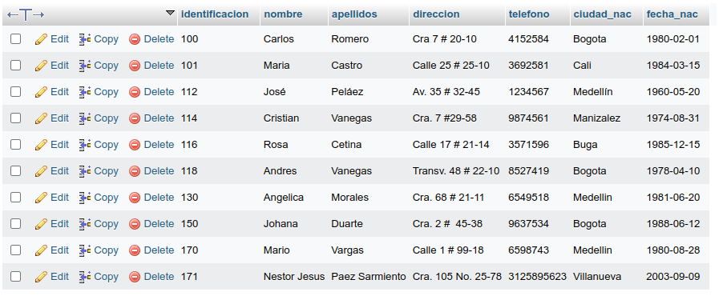
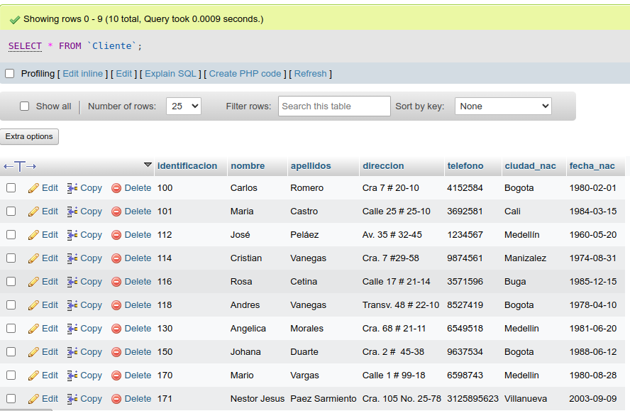
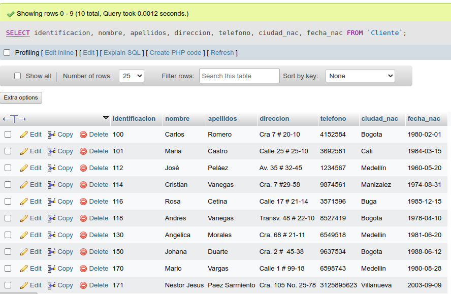
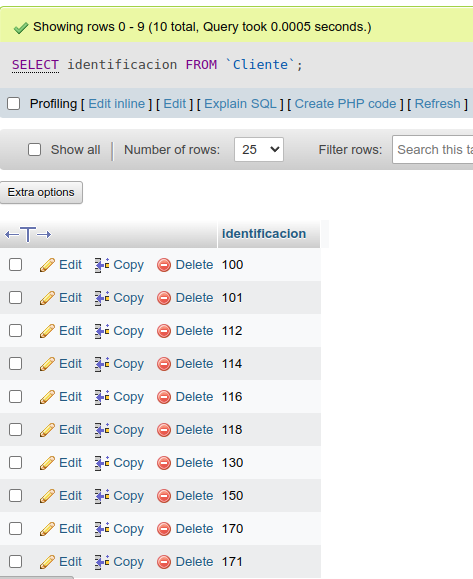
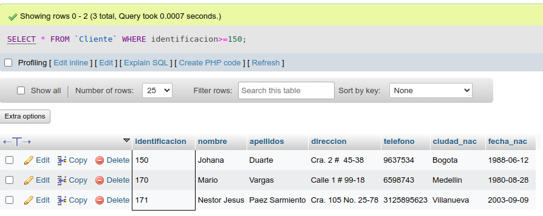
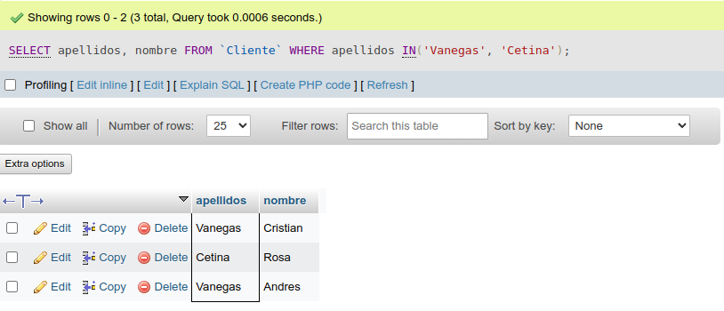
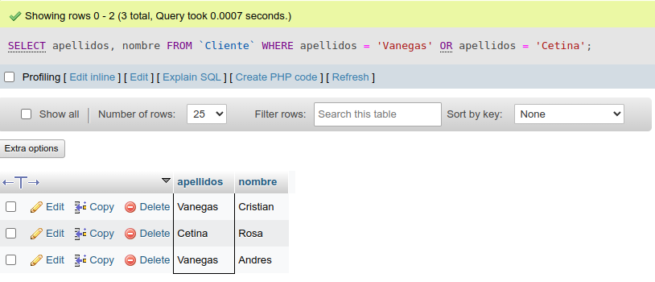
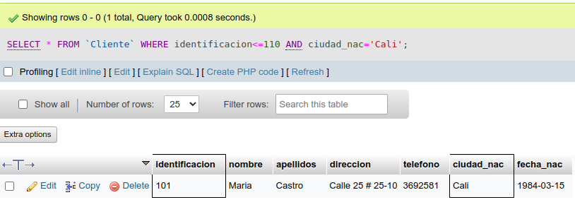
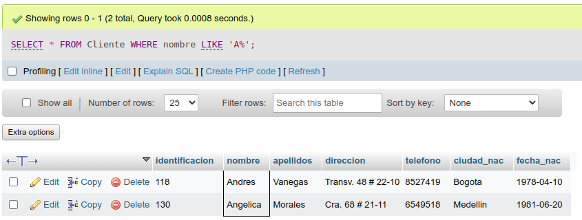

# consultas_1_sql
# Introducción a las consultas a una BD usando el lenguaje SQL

## Base de datos: Ventas
## Tabla: Cliente

## Instruccion SELECT
- Permite seleccionar datos de una tabla.
- Su formato es: `SELECT campos_tabla FROM nombre_tabla`

### Consulta No. 1
1. Para visualizar toda la información que contiene la tabla Cliente se puede incluir con la instrucción SELECT el carácter **\*** o cada uno de los campos de la tabla.

- `SELECT * FROM Cliente`

- `SELECT identificacion, nombre, apellidos, direccion, telefono, ciudad_nac, fecha_nac FROM Cliente`

### Consulta No. 2

2. Para visualizar solamente la identificacion del Cliente: `SELECT identificacion FROM Cliente`

### Consulta No. 3

3. Si se desea obtener los registros cuya identificacion sea mayor o igual a 150, se debe utilizar la cláusula `WHERE` que especifica las condiciones que deben reunir los registros que se van a seleccionar: `SELECT * FROM Cliente WHERE identificacion>=150`

### Consulta No. 4

4. Se desea obtener los registros cuyos apellidos sean Vanegas o Cetina, se debe utilizar el operador `IN` que especifica los registros que se quieren visualizar de una tabla.

`SELECT apellidos, nombre FROM Cliente WHERE apellidos IN('Vanegas', 'Cetina')`

O se puede utilizar el operador `OR`

`SELECT apellidos, nombre FROM Cliente WHERE apellidos = 'Vanegas' OR apellidos = 'Cetina'`

### Consulta No. 5

5. Se desea obtener los registros cuya identificación sea menor de 110 y la ciudad sea Cali, se debe utilzar el operador `AND`

`SELECT * FROM Cliente WHERE identificacion<=110 AND ciudad_nac = 'Cali'`

### Consulta No. 6

6. Si se desea obtener los registros cuyos nombres empiecen por la letra 'A', se debe utilizar el operador `LIKE` que utiliza los patrones `%` (todos) y `_` (caracter).

`SELECT * FROM Cliente WHERE nombre LIKE 'A%'`

